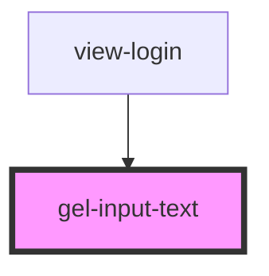

# gel-input-text

<!-- Auto Generated Below -->

## Properties

| Property       | Attribute       | Description | Type                                  | Default     |
| -------------- | --------------- | ----------- | ------------------------------------- | ----------- |
| `autoComplete` | `auto-complete` |             | `string`                              | `"off"`     |
| `disabled`     | `disabled`      |             | `boolean`                             | `undefined` |
| `formKey`      | `form-key`      |             | `string`                              | `undefined` |
| `inputClass`   | `input-class`   |             | `string or { [x: string]: boolean; }` | `""`        |
| `label`        | `label`         |             | `string`                              | `undefined` |
| `placeholder`  | `placeholder`   |             | `string`                              | `undefined` |
| `type`         | `type`          |             | `string`                              | `"text"`    |
| `value`        | `value`         |             | `string`                              | `undefined` |

## Events

| Event         | Description | Type                                            |
| ------------- | ----------- | ----------------------------------------------- |
| `inputUpdate` |             | `CustomEvent<{ formKey: string; value: any; }>` |

## Dependencies

### Used by

 - [view-login](../../../views/login)

### Graph

----------------------------------------------

*Built with [StencilJS](https://stenciljs.com/)*
