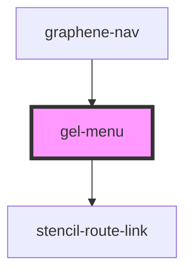

# gel-menu

<!-- Auto Generated Below -->

## Properties

| Property        | Attribute        | Description | Type                                  | Default     |
| --------------- | ---------------- | ----------- | ------------------------------------- | ----------- |
| `anchorClass`   | `anchor-class`   |             | `string or { [x: string]: boolean; }` | `{}`        |
| `categories`    | --               |             | `Category[]`                          | `undefined` |
| `categoryClass` | `category-class` |             | `string or { [x: string]: boolean; }` | `{}`        |
| `history`       | --               |             | `RouterHistory`                       | `undefined` |
| `listClass`     | `list-class`     |             | `string or { [x: string]: boolean; }` | `{}`        |
| `location`      | --               |             | `LocationSegments`                    | `undefined` |
| `menuClass`     | `menu-class`     |             | `string or { [x: string]: boolean; }` | `{}`        |

## Events

| Event      | Description | Type                    |
| ---------- | ----------- | ----------------------- |
| `navigate` |             | `CustomEvent<MenuItem>` |

## Dependencies

### Used by

 - [graphene-nav](../../graphene-nav)

### Depends on

- stencil-route-link

### Graph

----------------------------------------------

*Built with [StencilJS](https://stenciljs.com/)*
