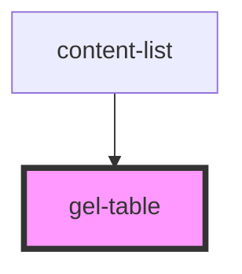

# gel-table

<!-- Auto Generated Below -->

## Properties

| Property  | Attribute | Description | Type                | Default     |
| --------- | --------- | ----------- | ------------------- | ----------- |
| `columns` | --        |             | `string[]`          | `undefined` |
| `history` | --        |             | `RouterHistory`     | `undefined` |
| `linkTo`  | --        |             | `(row: any) => any` | `undefined` |
| `order`   | `order`   |             | `"ASC" or "DESC"`   | `"ASC"`     |
| `rows`    | --        |             | `any[]`             | `undefined` |
| `sortBy`  | `sort-by` |             | `string`            | `"id"`      |

## Dependencies

### Used by

 - [content-list](../../views/content)

### Graph

----------------------------------------------

*Built with [StencilJS](https://stenciljs.com/)*
