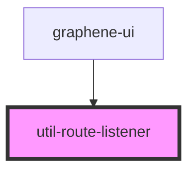

# util-route-listener

<!-- Auto Generated Below -->

## Properties

| Property | Attribute | Description | Type               | Default     |
| -------- | --------- | ----------- | ------------------ | ----------- |
| `props`  | --        |             | `RouteRenderProps` | `undefined` |

## Events

| Event            | Description | Type                            |
| ---------------- | ----------- | ------------------------------- |
| `pageDidUpdate`  |             | `CustomEvent<LocationSegments>` |
| `pageEnter`      |             | `CustomEvent<LocationSegments>` |
| `pageLeave`      |             | `CustomEvent<LocationSegments>` |
| `pageWillUpdate` |             | `CustomEvent<LocationSegments>` |

## Dependencies

### Used by

 - [graphene-ui](../graphene-ui)

### Graph

----------------------------------------------

*Built with [StencilJS](https://stenciljs.com/)*
