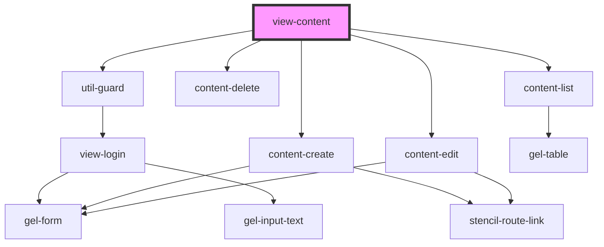

# view-content

<!-- Auto Generated Below -->

## Properties

| Property   | Attribute   | Description | Type           | Default     |
| ---------- | ----------- | ----------- | -------------- | ----------- |
| `isCreate` | `is-create` |             | `boolean`      | `undefined` |
| `isDelete` | `is-delete` |             | `boolean`      | `undefined` |
| `isEdit`   | `is-edit`   |             | `boolean`      | `undefined` |
| `match`    | --          |             | `MatchResults` | `undefined` |

## Events

| Event             | Description | Type                            |
| ----------------- | ----------- | ------------------------------- |
| `clearBreadcrumb` |             | `CustomEvent<void>`             |
| `pushBreadcrumb`  |             | `CustomEvent<[string, string]>` |

## Dependencies

### Depends on

- [util-guard](../../utils)
- [content-create](.)
- [content-delete](.)
- [content-edit](.)
- [content-list](.)

### Graph

----------------------------------------------

*Built with [StencilJS](https://stenciljs.com/)*
