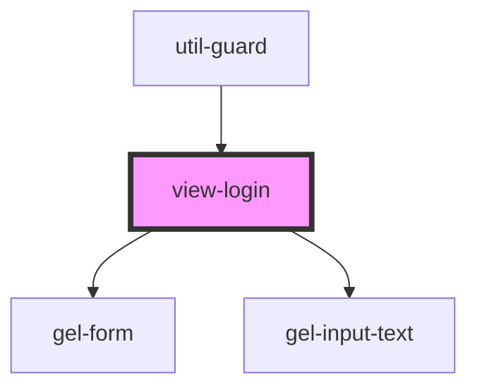

# view-login

<!-- Auto Generated Below -->

## Events

| Event             | Description | Type                                               |
| ----------------- | ----------- | -------------------------------------------------- |
| `clearBreadcrumb` |             | `CustomEvent<void>`                                |
| `login`           |             | `CustomEvent<{ name: string; password: string; }>` |
| `pushBreadcrumb`  |             | `CustomEvent<[string, string]>`                    |

## Dependencies

### Used by

 - [util-guard](../../utils)

### Depends on

- [gel-form](../../elements/form)
- [gel-input-text](../../elements/form/inputs)

### Graph

----------------------------------------------

*Built with [StencilJS](https://stenciljs.com/)*
