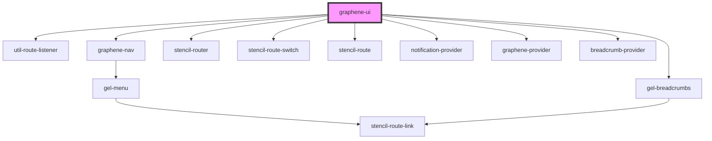

# graphene-ui

<!-- Auto Generated Below -->

## Properties

| Property   | Attribute   | Description | Type     | Default     |
| ---------- | ----------- | ----------- | -------- | ----------- |
| `endPoint` | `end-point` |             | `string` | `undefined` |
| `token`    | `token`     |             | `string` | `undefined` |

## Dependencies

### Depends on

- [util-route-listener](../utils)
- [graphene-nav](../graphene-nav)
- [gel-breadcrumbs](../elements/breadcrumbs)
- stencil-router
- stencil-route-switch
- stencil-route
- [notification-provider](../providers)
- [graphene-provider](../providers)
- [breadcrumb-provider](../providers)

### Graph

----------------------------------------------

*Built with [StencilJS](https://stenciljs.com/)*
