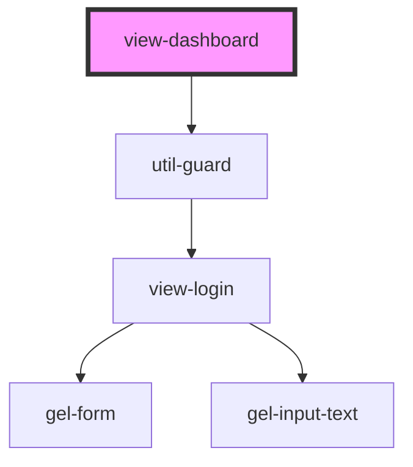

# view-dashboard

<!-- Auto Generated Below -->

## Events

| Event            | Description | Type                            |
| ---------------- | ----------- | ------------------------------- |
| `pushBreadcrumb` |             | `CustomEvent<[string, string]>` |

## Dependencies

### Depends on

- [util-guard](../../utils)

### Graph

----------------------------------------------

*Built with [StencilJS](https://stenciljs.com/)*
