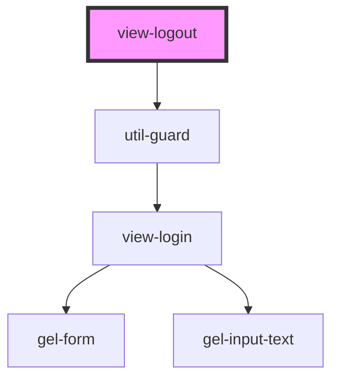

# view-logout

<!-- Auto Generated Below -->

## Events

| Event             | Description | Type                            |
| ----------------- | ----------- | ------------------------------- |
| `clearBreadcrumb` |             | `CustomEvent<void>`             |
| `logout`          |             | `CustomEvent<void>`             |
| `pushBreadcrumb`  |             | `CustomEvent<[string, string]>` |

## Dependencies

### Depends on

- [util-guard](../../utils)

### Graph

----------------------------------------------

*Built with [StencilJS](https://stenciljs.com/)*
